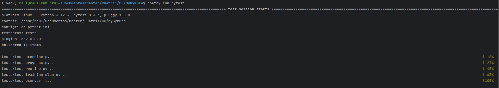
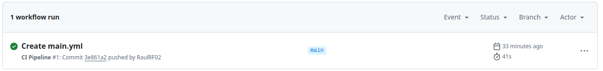
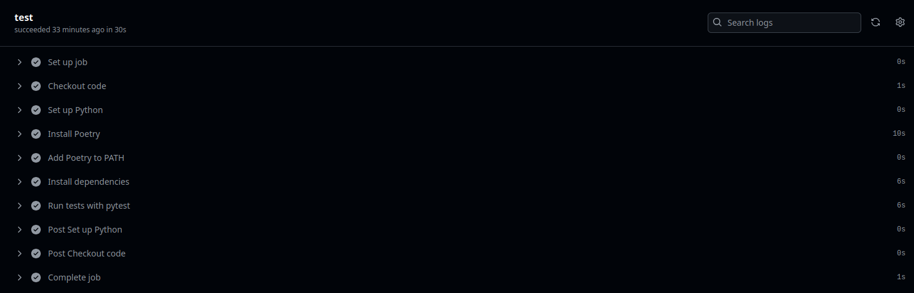

# **Hito 2**

## Gestor de tareas

Para el el desarrollo de este proyecto, he elegido Poetry como gestor de tareas. Esta elección se fundamenta en que 
Poetry no solo gestiona las dependencias del proyecto, sino que también permite automatizar la ejecución de scripts y 
tareas, lo que resulta ideal para un proyecto Python como el mío que requiere pruebas regulares y despliegues controlados.

Una de las principales razones para seleccionar Poetry es su capacidad para integrar la gestión de dependencias y 
la ejecución de tareas en un solo archivo (pyproject.toml). Esto simplifica la configuración y asegura las mismas 
versiones de las dependencias, eliminando posibles problemas de compatibilidad, algo crucial, 
ya que el proyecto depende de múltiples bibliotecas para gestionar endpoints, bases de datos y pruebas.

Además, Poetry permite definir scripts personalizados que se pueden ejecutar con comandos simples como poetry run. 
Por ejemplo, para ejecutar pruebas con pytest, podemos utilizar poetry run pytest, y para formatear el código con black,
usamos poetry run format .. 

Otra ventaja clave de Poetry es su gestión automática de entornos virtuales, lo que asegura que las dependencias no 
interfieran con otros proyectos en el sistema. También se integra perfectamente con herramientas de CI/CD como GitHub 
Actions, lo que permite configurar pipelines de forma sencilla. 

Aunque existen otras alternativas como Make o Invoke, estas requieren configuraciones más manuales y no ofrecen 
la gestión de dependencias integrada que proporciona Poetry. NPM Scripts y Gradle son más adecuados para entornos 
JavaScript o Java, mientras que Make es excelente en entornos Unix, pero puede ser excesivamente verboso para 
proyectos Python que no requieren compilación.

En resumen, Poetry es la mejor opción para mi proyecto porque combina gestión de dependencias, 
automatización de tareas y soporte para entornos CI/CD en una sola herramienta, lo que simplifica enormemente 
el flujo de trabajo. Con comandos como:

    poetry run python wsgi.py para iniciar la aplicación.
    poetry run format . para formatear el código.
    poetry run pytest para ejecutar los tests.

## Biblioteca de aserciones

En el desarrollo de MyGymBro, he elegido pytest como biblioteca de aserciones después de analizar varias alternativas. 
Aunque Python cuenta con la biblioteca estándar unittest, opté por pytest debido a su sintaxis más simple y flexible, 
lo que facilita la escritura y el mantenimiento de tests. La capacidad de utilizar la palabra clave assert de forma 
directa permite escribir pruebas claras y concisas, lo que es ideal para un proyecto con múltiples endpoints y lógica 
de negocio como el mío.

La elección de pytest se alinea con un enfoque TDD (Test-Driven Development), que se adapta mejor a la validación de la 
lógica interna del sistema. Sin embargo, pytest también ofrece soporte para BDD (Behavior-Driven Development) mediante 
plugins como pytest-bdd, lo que nos brinda la flexibilidad de extender nuestras pruebas a escenarios orientados al 
comportamiento, si fuera necesario en el futuro.

Otra ventaja crucial de pytest es su sistema de fixtures, que permite configurar y limpiar el entorno de pruebas de 
forma eficiente. Esto resulta fundamental en MyGymBro, ya que probamos funcionalidades que dependen de datos dinámicos 
y endpoints. 

## Test runner

De la misma manera, he elegido pytest como test runner tras evaluar varias alternativas en Python. Aunque unittest es 
la opción estándar integrada en el lenguaje, pytest destaca por su simplicidad, flexibilidad y mejor 
integración con CI/CD como ya he mencionado antes.

Una de las mayores ventajas de pytest es su capacidad de autodetección de archivos y funciones de prueba, 
lo que simplifica la organización y ejecución de los tests. Esto es especialmente útil en MyGymBro, donde se 
requieren pruebas constantes para validar endpoints y lógica de negocio. Además, pytest genera informes detallados 
que facilitan la identificación de errores, agilizando la resolución de problemas.

## Sistema de prueba de código online

Para asegurar la calidad y estabilidad del proyecto, he optado por utilizar GitHub Actions como sistema de integración 
continua (CI). He configurado un pipeline en GitHub Actions que automatiza la ejecución de tests cada vez que se 
realiza un push a las ramas main o master. Para ello, he creado un archivo .yml en el directorio .github/workflows del 
proyecto. Esta configuración utiliza Poetry para gestionar dependencias y pytest para ejecutar las pruebas, 
asegurando que todo se ejecute en un entorno controlado.

### Resumen de la Configuración:

- **Checkout del código:** Utilizo actions/checkout para clonar el repositorio en el entorno de GitHub Actions.
- **Configuración del entorno:** Se instala Python 3.12 y Poetry, que es el gestor de dependencias del proyecto.
- **Instalación de dependencias:** Mediante poetry install, se asegura que todas las librerías necesarias estén disponibles.
- **Ejecución de tests:** Utilizo poetry run pytest para ejecutar todas las pruebas, generando un informe de cobertura del código.

Este pipeline se ejecuta en cada push y pull request, permitiéndonos detectar fallos de forma temprana antes de 
fusionar cambios en la rama principal. Esto asegura que el proyecto se mantenga estable y libre de errores.

## Resumen de Tests 

A continuación, se presenta un resumen de los tests realizados para cada modelo y funcionalidad.
- **Gestión de usuarios**: Validación del registro, inicio de sesión, y manejo de errores en la autenticación.
- **Gestión de ejercicios**: Verificación de la creación y obtención de ejercicios en la aplicación.
- **Seguimiento del progreso**: Asegura que los registros de progreso se creen y gestionen correctamente para los usuarios.
- **Gestión de rutinas**: Comprobación de la creación, asignación y obtención de rutinas personalizadas.
- **Planes de entrenamiento**: Validación de la creación y consulta de planes de entrenamiento, garantizando que los usuarios puedan acceder a sus planes según lo configurado.

## Evidencia de Ejecución de Tests

A continuación, se presentan capturas de pantalla que demuestran que todos los tests se ejecutaron exitosamente 
utilizando `pytest`. Estas evidencias aseguran que las funcionalidades principales de *MyGymBro* 
están operando correctamente y que el código pasa los controles de calidad antes de ser integrado en el proyecto.

### Captura de Pantalla

_Ejecución de los tests en PyCharm con poetry_

_Ejecución del pipeline en GitHub Actions_

_Log de los tests en GitHub Actions_